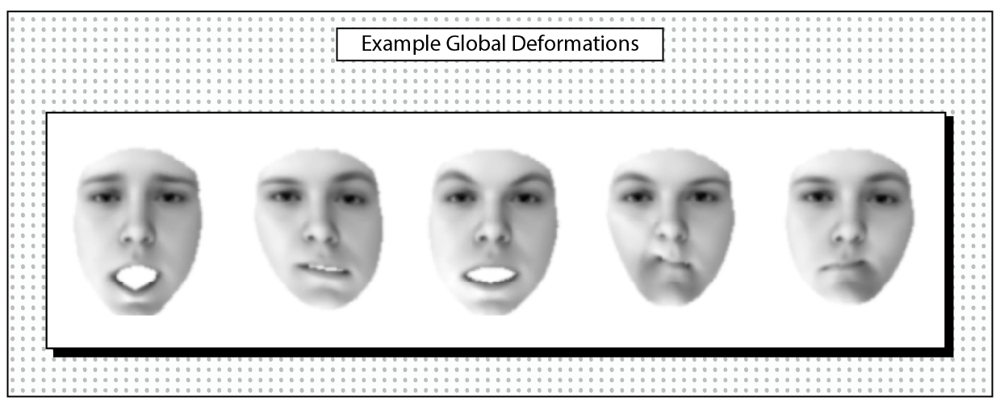

---
layout:
  width: default
  title:
    visible: false
  description:
    visible: false
  tableOfContents:
    visible: true
  outline:
    visible: true
  pagination:
    visible: true
  metadata:
    visible: false
---

# Facial Expressions

<h2 align="center">Facial Expressions</h2>

Facial expressions are a key aspect of facial behavior, closely linked to social and emotional processes and influenced by mental health, mood, and personality. These expressions serve both emotional and communicative functions and can be either spontaneous or deliberate. Bitbox offers multiple data types and methods to capture, measure, and analyze facial expressions effectively.

### Facial Landmark Points

Facial landmarks are a set of points on the face that correspond to features, such as brows, eyes, noise, mouth. By tracking these points throughout a video, we can quantify the facial expressions and behavior at each frame, as the facial features correspond to parts of the face that move with facial expressions. An advantage of these landmarks over other forms of expression quantifiers (see below for [expression related deformations](facial-expressions.md#expression-related-global-deformations) and [localized expression units](facial-expressions.md#localized-expression-units)) is that they provide movement in a metric space, in terms of millimeters, and therefore can be useful in applications where geometric distances matter. Moreover, users can conduct analyses that require tracking specific landmark points on the face (_e.g._, lip corners).

Most facial analysis processors (_e.g._, OpenFace) only provides landmarks in 2D space, which is known to be affected by head pose and facial morphology. Processors 3DI and 3DI-lite, however, provide facial landmarks both in 2D and in 3D. The latter include a variant called canonicalized 3D landmarks, which are particularly useful for the analysis of expressions, as they remove the effect of head movements, which often occur in naturalistic videos. Also, canonicalized 3D landmarks eliminate the effect of person-specific facial morphology, which is also advantageous for expression analysis, as certain personal characteristics (_e.g._, lower-than-usual eyebrows, wider-than-usual mouth) can be mistaken by algorithms are expression-related facial deformations. Both 3DI and 3DI-lite use the iBUG-51 landmark template, which tracks the brows, eyes, nose and mouth with 51 landmarks. See [output formats](../overview/outputs.md#id-2d-face-landmarks) for more details.

```python
from bitbox.face_backend import FaceProcessor3DI as FP
processor = FP()
...
# detect 2D landmarks
lands2D = processor.detect_landmarks()

# detect 3D landmarks
exp_global, pose, lands3D = processor.fit()
```

Landmarks can be used to compute [biomechanical properties](broken-reference), [symmetry](symmetry.md), and [social dynamics](broken-reference) of facial expressions.&#x20;

### Expression Related Global Deformations

An alternative method for studying facial expressions involves using per-frame expression vectors. These vectors describe the facial deformation related to expressions across the entire face. 3DI and 3DI-lite processors output vectors as 79 expression coefficients. Each coefficient measures the presence level of a specific facial morphology type. The deformations are global, impacting the entire face and may be neither interpretable nor physically plausible on their own. However, their combination produces the observed and thus plausible expression.

<figure><figcaption></figcaption></figure>

```python
# compute global expressions
exp_global, pose, lands3D = processor.fit()
```

As explained in [output formats](../overview/outputs.md#facial-expressions), the variable `exp_global` contains 79 coefficients (presence levels of 79 deformations) per frame. These coefficients can be used to compute [expressivity](expressivity.md), [diversity](diversity.md), and [social dynamics](broken-reference) of facial expressions.&#x20;

By default, global expression coefficients will have varying scales/magnitudes. You can normalize them to have similar scales. This process also removes estimated noise, so you may end up with losing some data. Although we highly recommend using this option, please use with caution.

```python
# Noise removal and normalization
exp_global, pose, lands3D = processor.fit(normalize=True)

# same parameter can be used wiht run_all as well
rects, lands, exp_global, pose, lands3D, exp_local = processor.run_all(normalize=True)
```

### Localized Expression Units

The most widely used representation of facial expressions is Action Units (AUs), defined by the Facial Action Coding System (FACS). Each AU corresponds to a specific, localized movement of one or more facial muscles and is designed to be anatomically interpretable. Although FACS was originally developed for manual annotation, numerous computational tools now enable the automatic detection of AUs in video recordings. OpenFace is one such widely used tool. Bitbox will soon support OpenFace and generate AUs.

Due to significant structural limitations of automated AU detectors (see [this article ](https://doi.org/10.1109/FG61629.2025.11099288)for more details), Bitbox also adapts an alternative approach to generate localized, and interpretable facial expression units, similar to AUs, generated by 3DI and 3DI-lite backends. The facial expression units are per-frame expression vectors, each describing the expression-related motion of a specific facial region. As this is a data-driven approach, learned expression units differ between 3DI and 3DI-lite. Both processors provide pre-trained facial expression units, trained on a large sample of videos.&#x20;

```python
# compute localized expression units
exp_local = processor.localized_expressions()
```

As explained in [output formats](../overview/outputs.md#facial-expressions), the variable `exp_local` contains 32 (3DI) or 50 (3DI-lite) coefficients per frame, each quantifying the presence level of a facial expression unit. These coefficients can be used to compute [expressivity](expressivity.md), [diversity](diversity.md), and [social dynamics](broken-reference) of facial expressions.


The ongoing research by our team on localized expression units chiefly uses 3DI-lite, thus local expression units using 3DI-lite may give better results than using 3DI.&#x20;


See below for visual rendering of 50 localized expression units generated by 3DI-lite. You can see more details on how certain units map into Action Units of FACS in [this paper](https://doi.org/10.1109/FG61629.2025.11099288) (see Table 2).


