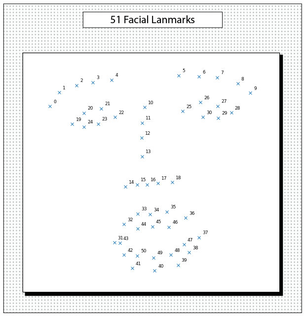

---
layout:
  width: default
  title:
    visible: false
  description:
    visible: false
  tableOfContents:
    visible: true
  outline:
    visible: true
  pagination:
    visible: true
  metadata:
    visible: false
---

# Output Formats

<h2 align="center">Output Formats</h2>

Each backend processor generates outputs in a specific format, usually written to the disk as a text file. Thus, original output formats exhibit significant variations across backends. Bitbox, therefore, includes wrapper functions that convert these outputs into a standard Python dictionary format.&#x20;

### File Caching System

Running backend processors to produce output files might take some time, usually a few minutes per video file, depending on specific hardware requirements. To enhance analysis efficiency and provide a versioning system, Bitbox includes an integrated file caching mechanism.

Each time a processor is run, Bitbox checks if the output files and their metadata, which detail the last execution, already exist in the specified output directory. This metadata is stored as `.json` files. If the files and metadata are found, Bitbox verifies if the time elapsed since their last creation is within the retention period (default is 6 months). If it is, Bitbox uses the existing files, avoiding the need to recreate them. This process significantly saves time.&#x20;

Adjust the retention time according to your requirements.&#x20;

```python
# you can set the retention period using natural language: 1 year, 3 minutes, etc.
processor.cache.change_retention_period('1 year')
```

Each file saved to disk will have an accompanying `.json` file, named identically, that tracks the details of the most recent execution.

```json
    "backend": "3DI",
    "morphable_model": "BFMmm-19830",
    "camera": 30,
    "landmark": "global4",
    "fast": false,
    "local_bases": "0.0.1.F591-cd-K32d",
    "input_hash": "4e31c4610ad3641ed651394855516d7989f9c5b3127520add6d87efc5618c162",
    "cmd": "CUDA_VISIBLE_DEVICES=1 docker run --rm --gpus device=1 -v /home/test/bitbox/tutorials/data:/app/input -v /home/test/bitbox/tutorials/output:/app/output -w /app/3DI bitbox:cuda12 ./video_detect_landmarks /app/input/elaine.mp4 /app/output/elaine_rects.3DI /app/output/elaine_landmarks.3DI /app/3DI/configs/BFMmm-19830.cfg1.global4.txt > /dev/null",
    "input": "/home/test/bitbox/tutorials/data/elaine.mp4",
    "output": "/home/test/bitbox/tutorials/output",
    "time": "2025-07-18 12:33:50"
```

### Outputs

Bitbox returns Python dictionaries by default after each processing step, allowing users to easily manipulate the output. If you prefer that the steps return nothing, and only generate backend output files, set the `return_output` parameter to `None`. To receive paths of the generated files, set it to `'file'`.

```python
# define a face processor
processor = FP(runtime='bitbox:latest', return_output=None)
```

### Output Formats

Below is a list of common components of face and body analysis pipelines and their associated outputs.  The wrapper functions generate these _raw_ behavioral signals, which serve as inputs for analysis functions to produce behavioral measurements. Details on outputs of analysis functions are given in [Psychomotor Behavior](../psychomotor-behavior/), [Affective Expressions](../affective-expressions/), and [Interpersonal Dynamics](../interpersonal-dynamics/) sections.

#### Face Rectangles

The dictionary containing the coordinates for the face rectangles is structured as follows.

```python
frame count: int # number of frames in the processed video file
format: str # string specifying what is included in the 'data' variable
dimension: int # dimensionality of the data (2D)
data: DataFrame # actual data as a Pandas dataframe, including rectangle coordinates for each frame
```

```python
print(rects)
```

```python
{'frame count': 288,
 'format': 'for each frame (rows) [x, y, w, h] values of the detected rectangles',
 'dimension': 2,
 'data': x      y      w      h
 0    1215.0  205.0  222.0  315.0
 1    1221.0  198.0  222.0  325.0
 2    1228.0  193.0  229.0  333.0
 3    1236.0  183.0  224.0  333.0
 4    1233.0  174.0  231.0  335.0
 ..      ...    ...    ...    ...
 283   865.0  260.0  239.0  334.0
 284   862.0  263.0  239.0  337.0
 285   857.0  265.0  242.0  334.0
 286   859.0  272.0  240.0  324.0
 287   857.0  270.0  241.0  324.0
 
 [288 rows x 4 columns]}
```

#### Head Pose

The dictionary containing head pose is structured as follows.

```python
frame count: int # number of frames in the processed video file
format: str # string specifying what is included in the 'data' variable
dimension: int # dimensionality of the data (3D)
data: DataFrame # actual data as a Pandas dataframe, including pose information for each frame
```

```python
print(pose)
```

```python
{'frame count': 287,
 'format': 'for each frame (rows) [Tx, Ty, Tz, Rx, Ry, Rz] values of the detected face pose',
 'dimension': 3,
 'data':  Tx         Ty           Tz        Rx        Ry        Rz
 0    187.123658 -87.795922  2003.171771  0.496597  0.162299  0.284269
 1    188.102216 -88.103604  1972.986681  0.509940  0.164223  0.269109
 2    187.940688 -89.569477  1918.995972  0.569836  0.160639  0.230382
 3    187.737832 -92.554330  1896.683965  0.627746  0.168752  0.216200
 4    186.931261 -94.903214  1893.744463  0.636808  0.144716  0.187700
 ..          ...        ...          ...       ...       ...       ...
 282   -8.222353 -53.803540  1876.398471  0.430963 -0.013720  0.224957
 283   -8.397185 -52.155949  1888.724260  0.426779  0.031317  0.208225
 284   -8.573571 -50.384615  1879.183571  0.486395  0.062021  0.201555
 285   -8.792175 -49.050115  1887.730682  0.501626  0.071882  0.202533
 286   -8.880987 -48.141726  1906.807405  0.470053  0.076482  0.198375
 
 [287 rows x 6 columns]}
```

The first three values (Tx, Ty, Tz) are the x, y, z coordinates of the translation vector and the last three values (Rx, Ry, Rz) are yaw, pitch, roll angles of the rotation vector.


The frame count for pose estimation (287) is one less than the frames reported for face rectangles (288). This difference arises because pose estimation occurs after 3D fitting, which involves comparing subsequent frames.


#### 2D Face Landmarks

The dictionary containing the coordinates for the facial landmarks is structured as follows.

```python
frame count: int # number of frames in the processed video file
format: str # string specifying what is included in the 'data' variable
schema: str # schema used to specify landmarks (ibug, 51 landmarks)
dimension: int # dimensionality of the data (2D)
data: DataFrame # actual data as a Pandas dataframe, including landmark coordinates for each frame
```

```python
print(lands)
```

```python
{'frame count': 288,
 'format': 'for each frame (rows) [x, y] values of the detected landmarks',
 'schema': 'ibug51',
 'dimension': 2,
 'data':  x0        y0         x1        y1         x2        y2         x3  ...
 0    1224.4790  296.0114  1233.1770  287.3135  1249.4570  282.9645  1263.5560   
 1    1232.9160  292.8213  1241.7780  283.9591  1256.1430  280.6538  1269.4360   
 2    1240.9470  284.4601  1246.6020  273.0579  1260.2620  270.8003  1272.8200   
 3    1247.0530  272.9127  1251.5640  262.7444  1261.6780  259.3790  1274.1200   
 4    1246.1510  267.1030  1250.7380  254.5068  1261.0230  252.2312  1273.6750   
 ..         ...       ...        ...       ...        ...       ...        ...   
 283   880.9209  346.9649   885.5663  333.0286   899.5026  328.3832   909.9173   
 284   877.3620  351.0323   882.0314  340.5635   896.0399  337.0238   907.6625   
 285   878.5314  356.2017   880.8151  344.5451   892.5399  342.1933   905.3604   
 286   877.1978  360.8223   880.6052  350.5219   890.9056  347.1144   904.6136   
 287   875.5114  362.1016   880.0887  352.9469   889.2433  349.5334   902.9753   
 
 [288 rows x 102 columns]}
```

Below is an illustration showcasing the 51 landmarks from the iBUG schema included in Bitbox.

<figure><figcaption></figcaption></figure>

#### 3D Face Landmarks

3DI and 3DI-Lite backends also identify 3D coordinates for the same 51 landmarks in a standardized/canonicalized template, adjusted for pose and individual identity. These coordinates effectively represent expression-related motion only. The dictionary containing these coordinates is structured as follows.

```python
frame count: int # number of frames in the processed video file
format: str # string specifying what is included in the 'data' variable
schema: str # schema used to specify landmarks (ibug, 51 landmarks)
dimension: int # dimensionality of the data (3D)
data: DataFrame # actual data as a Pandas dataframe, including landmark coordinates for each frame
```

```python
print(lands_can)
```

```python
{'frame count': 287,
 'format': 'for each frame (rows) [x, y, z] values of the canonicalized landmarks',
 'schema': 'ibug51',
 'dimension': 3,
 'data': x0       y0       z0       x1       y1      z1       x2       y2  ...
 0   -56.9614  39.6920   9.3094 -49.3939  44.6350 -3.1342 -39.0107  46.6001   
 1   -57.0276  39.8766   9.3651 -49.4318  45.0094 -2.9794 -39.0013  47.0016   
 2   -57.1266  40.2060   9.3909 -49.5090  45.6634 -2.7643 -39.0154  47.6731   
 3   -57.1484  40.4837   9.3855 -49.5165  46.2033 -2.6046 -38.9661  48.2093   
 4   -57.1006  40.6295   9.3744 -49.4611  46.4978 -2.5212 -38.8871  48.4915   
 ..       ...      ...      ...      ...      ...     ...      ...      ...   
 282 -56.1713  42.5542  10.8096 -47.9620  50.2364  0.0222 -36.8772  52.5977   
 283 -56.2558  42.3219  10.5654 -48.0127  49.8303 -0.3302 -37.0355  52.0235   
 284 -56.4552  41.4071   9.9169 -48.5834  47.6052 -1.7489 -37.9054  49.4367   
 285 -56.7055  41.1858   9.6896 -49.0115  46.8687 -2.3016 -38.4578  48.5502   
 286 -56.6558  41.2409   9.7392 -48.9824  46.7827 -2.3388 -38.4274  48.4168 
 
 [287 rows x 153 columns]}
```


The frame count for 3D landmarks (287) is one less than the frames reported for 2D landmarks (288). This difference arises because 3D landmark estimation occurs after 3D fitting, which involves comparing subsequent frames.


#### Facial Expressions

The dictionary containing facial expressions is structured as follows.

```python
frame count: int # number of frames in the processed video file
format: str # string specifying what is included in the 'data' variable
schema: str # schema used to specify expressions
dimension: int # dimensionality of the data (3D)
data: DataFrame # actual data as a Pandas dataframe, including expression information for each frame
```

```python
print(pose)
```

```python
{'frame count': 287,
 'format': 'for each frame (rows) [GE0, GE1, ..., GE78] values corresponding to global expression coefficients',
 'schema': '3DI-G79',
 'dimension': 3,
 'data':  GE0         GE1         GE2         GE3         GE4         GE5  ...
 0     753.423783 -194.042372  197.960444  106.690543   21.592683   91.242415   
 1     937.014156 -139.143482  266.905796  100.993156  -39.710237   95.801747   
 2     999.748891  -94.617522  329.888134   74.909884 -133.090316   90.830946   
 3    1039.275017  -58.833691  384.776788   53.712042 -166.856334   87.251652   
 4    1044.217388  -13.178934  413.527918   63.785587 -175.551318   78.706730   
 ..           ...         ...         ...         ...         ...         ...   
 282   582.167007 -102.000016  204.224098  119.514883  160.387931 -235.299366   
 283   380.012303  -88.098474  305.584339  -25.276841  -96.628787  -66.184308   
 284   522.439780 -129.613056  226.731498   47.404188  -16.625039  189.778500   
 285   523.708525 -165.942584  153.147690   55.624673  -77.211004  277.277211   
 286   585.121520 -234.852410  111.955847   90.322975   31.649301  295.189259   
  
 [287 rows x 79 columns]}
```

Depending on the backend processor used, the columns of the data frame have different meanings. With 3DI and 3DI-Lite, they may represent global, non-interpretable facial deformations along 79 PCA directions if generated by `processor.fit()`. Alternatively, they can denote localized, interpretable facial motions, similar to Action Units, if generated by `processor.localized_expressions()`. The `format` field will inform you of their specific representation. Wiht OpenFace (coming soon), they will correspond to Action Units.

#### Body Joints

Coming Soon


