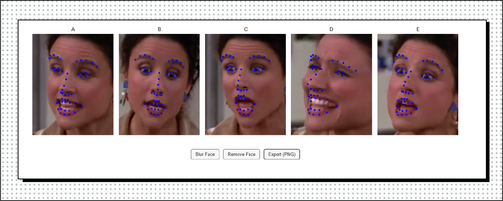
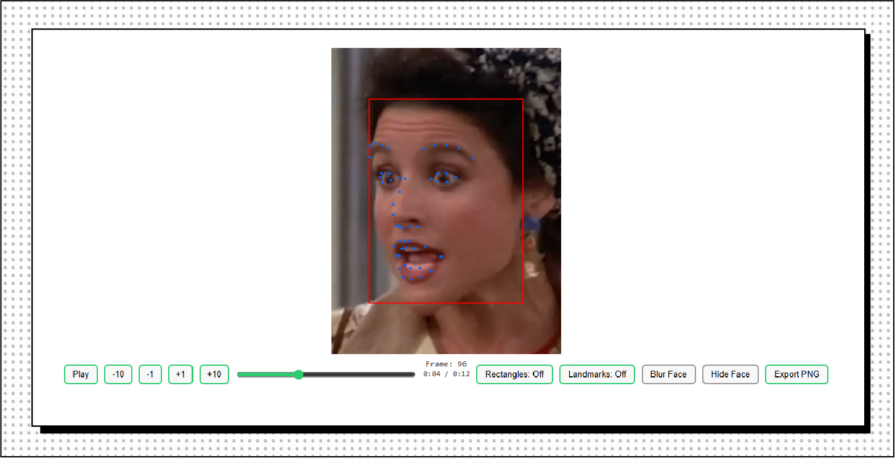
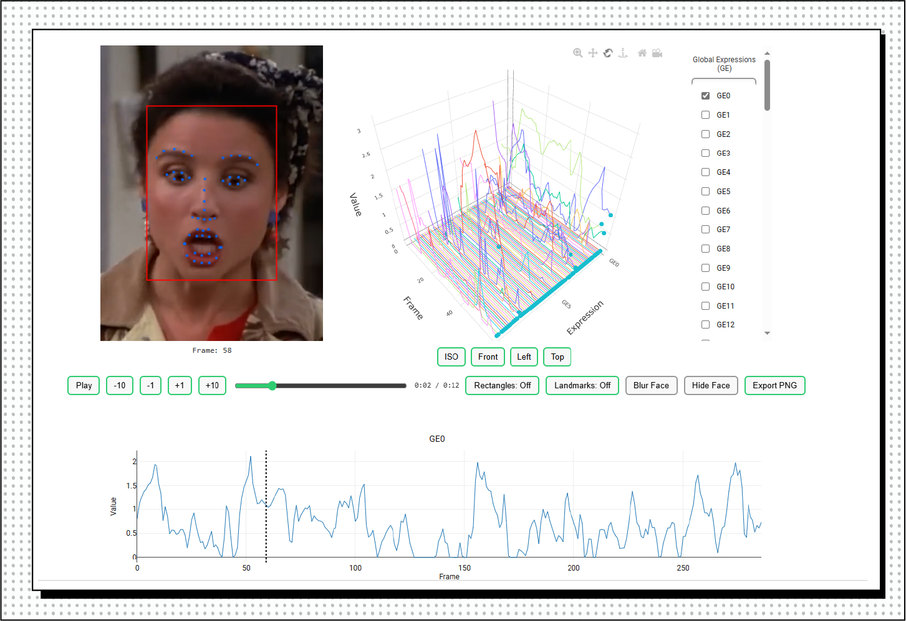

---
layout:
  width: default
  title:
    visible: false
  description:
    visible: false
  tableOfContents:
    visible: true
  outline:
    visible: true
  pagination:
    visible: true
  metadata:
    visible: false
---

# Visualization

<h2 align="center">Visualization and Plotting</h2>

Bitbox has advanced visualization capabilities specialized for face and body analysis. Plotting functionality uses Plotly, an open-source visualization library, to generate web-based interactive plots.&#x20;

Currently, you can visualize face rectangles, landmarks (both 2D and 3D), pose, and expressions (both global and local).

<pre class="language-python"><code class="lang-python"># define input file and output directory
input_file = 'data/elaine.mp4'
output_dir = 'output'

# define a face processor
processor = FP(runtime='bitbox:latest')

# set input and output
processor.io(input_file=input_file, output_dir=output_dir)
<strong>
</strong><strong># detect faces
</strong>rects = processor.detect_faces()

# detect 2D landmarks
lands = processor.detect_landmarks()

# compute global expressions, pose, and 3D canonicalized landmarks
exp_global, pose, lands_can = processor.fit()
</code></pre>

The output is an HTML/JS file located in the output directory. You can open the file in any web browser. As the included JS generates video frames on the fly, it may take a few seconds to fully load on the browser. Please be patient!

```python
# visualize landmarks at random poses
processor.plot(lands, pose=pose)
```

<figure><figcaption></figcaption></figure>

```python
# visualize landmarks with rectangles overlayed
processor.plot(lands, overlay=[rects], video=True) 
```

<figure><figcaption></figcaption></figure>

```python
# visualize expressions
processor.plot(exp_global, overlay=[rects, lands], video=True)
```

<figure><figcaption></figcaption></figure>
